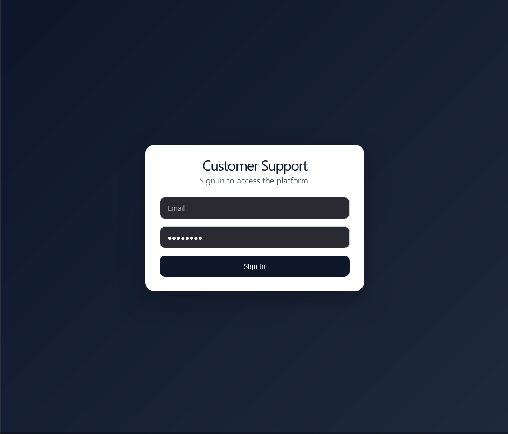
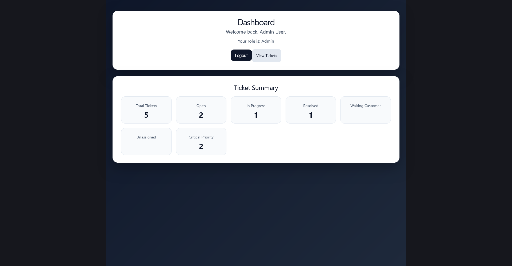
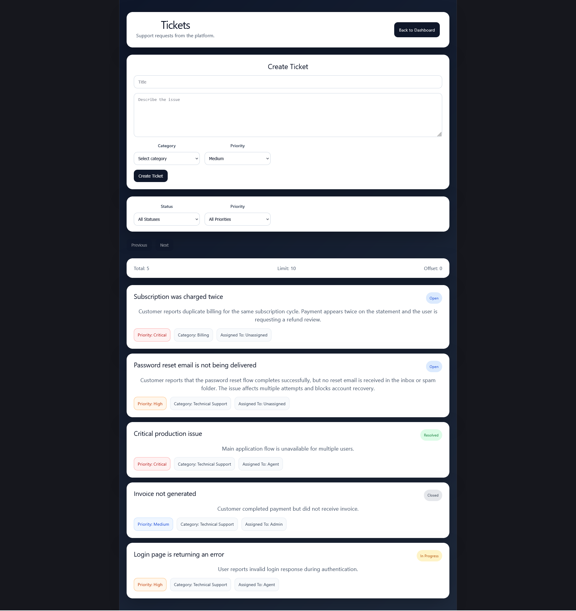
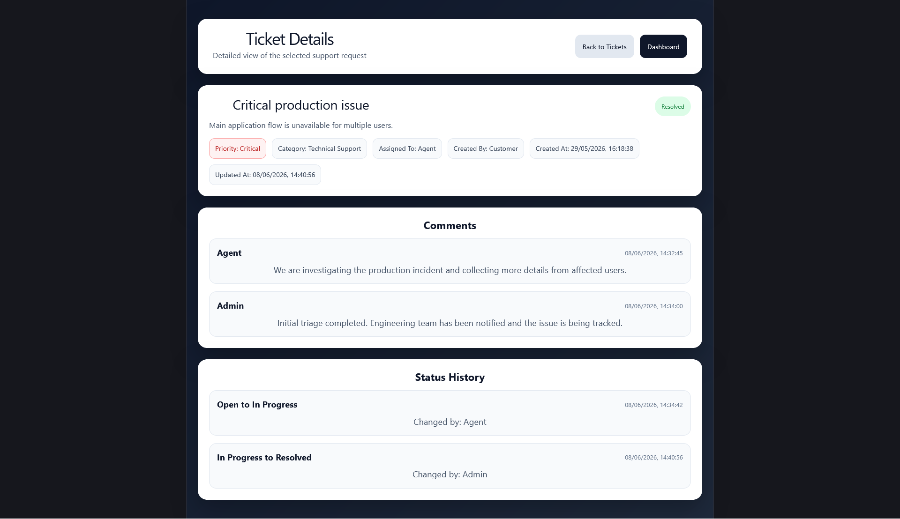

# Customer Support Platform

[](https://github.com/dmarinhoDKR/customer-support-platform/actions/workflows/ci.yml)
[](https://github.com/dmarinhoDKR/customer-support-platform/actions/workflows/cd.yml)

<p align="center">
  
  
  
  
  
  
  
  
  
  
  
  
  
  
  
  
  
  
  
  
</p>

Customer Support Platform is a full-stack ticket management application built with React, ASP.NET Core Web API, SQL Server, and Docker. The project includes JWT authentication, dashboard metrics, ticket creation, filtering, detailed ticket views, comments, assignment, and status history, simulating a real-world customer support workflow.

## Overview

This project simulates a real-world customer support workflow with authentication, dashboard metrics, ticket creation, ticket details, comments, status history, and paginated data access.

## Screenshots

### Login
Authentication screen for platform access.



### Dashboard
Overview of ticket metrics and user session information.



### Tickets
Ticket listing with filtering, pagination, and ticket creation form.



### Ticket Details
Detailed ticket view with metadata, comments, and status history.



## Tech Stack

### Frontend
- React
- TypeScript
- Vite
- Axios
- React Router

### Backend
- ASP.NET Core Web API
- .NET 10
- Entity Framework Core
- SQL Server 2022
- JWT Authentication
- BCrypt
- Swagger


### Environment
- WSL Ubuntu
- Docker Desktop
- Docker Compose

## Highlights

- Full-stack application with React frontend and ASP.NET Core Web API backend
- JWT authentication with protected routes
- Ticket creation, listing, filtering, and detailed ticket views
- Ticket comments, assignment, and status history
- SQL Server running in Docker with persistent volume
- WSL-based Linux development environment
- Backend configuration via environment variables for local secrets
- GitHub Actions CI pipeline for build validation and CD workflow for release artifact preparation
- Postman collection for manual API testing and QA workflows

## Current Features

- JWT-based authentication
- Protected frontend routes
- Dashboard summary
- Ticket creation
- Ticket listing
- Filtering and sorting
- Pagination with `pageNumber/pageSize` and `limit/offset`
- Visual status and priority badges
- Ticket details page
- Ticket comments
- Ticket assignment
- Ticket status history
- SQL Server running in Docker with persistent volume
- GitHub Actions CI/CD workflows for build validation and release artifact generation
- Automatic database migration on backend startup

## API Testing

A Postman collection is included to support manual API validation, authentication flow checks, and endpoint testing across the platform.

Postman collection:
- `docs/postman/CustomerSupport.postman_collection.json`

Covered flows:
- Authentication
- Dashboard summary
- Ticket listing
- Ticket creation
- Ticket lookup by id
- Ticket status update
- Ticket assignment
- Ticket comments
- Ticket status history

## Run Locally

### 1. Create your local environment file

From the project root:

```bash
cp .env.example .env
```

Update `.env` with your local development values.

### 2. Start the database

From the project root:

```bash
set -a
source .env
set +a
docker compose up -d
```

### 3. Run the backend

From the `backend` folder, in the same shell session used to load `.env`:

```bash
cd backend
dotnet run --project ./CustomerSupport.API/CustomerSupport.API.csproj

API:
- http://localhost:5132/swagger

### 4. Run the frontend

From `frontend`:

```bash
npm install
npm run dev
```

Frontend:
- http://localhost:5173

## Development Credentials

- Admin: `admin@customersupport.com` / `admin123`
- Agent: `agent@customersupport.com` / `admin123`
- Customer: `customer@customersupport.com` / `admin123`

## Notes

- Local secrets are stored in `.env`, which is ignored by Git.
- The repository includes `.env.example` as a configuration template.
- The backend applies migrations automatically on startup.

## Roadmap

- Improved login error handling
- Backend API containerization
- UI refinements
